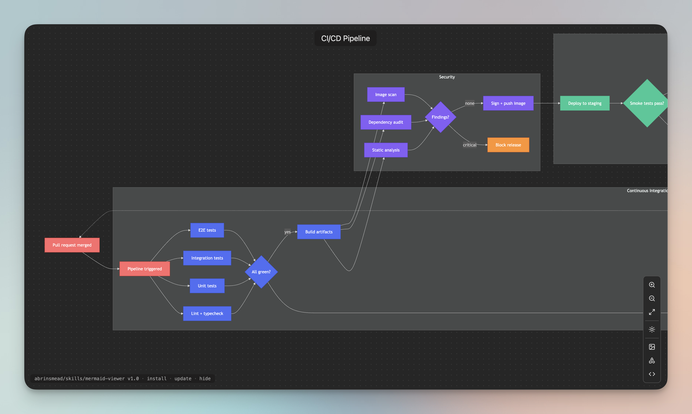

# mermaid-viewer

An [agent skill](https://agentskills.io) that renders Mermaid diagrams into interactive HTML: pan/zoom, light/dark themes, PNG/SVG export. Each generated file is fully self-contained — nothing to run or host, no network requests, works offline.

Derived from [mindpilot-mcp](https://github.com/abrinsmead/mindpilot-mcp): the agent writes a `.mmd` file, runs one build script, and opens the result in your browser.



## Install

Installs via [skills.sh](https://skills.sh), the open agent skills CLI:

```
npx skills add abrinsmead/skills/mermaid-viewer
```

Update:

```
npx skills update mermaid-viewer
```

`add` takes the full `owner/repo/skill` source path; `update` takes the installed skill's name.

Works with Claude Code and other agents that support the SKILL.md convention. Requires Node.js ≥ 18.

## Usage

Ask your agent for a diagram:

- "Diagram the request lifecycle in this codebase"
- "Draw an ERD of the database schema"
- "Show the deployment pipeline as a flowchart"
- "Map the checkout process as a swimlane across customer, frontend, and payment service"

The agent writes Mermaid source to `.diagrams/<name>.mmd` in your project, builds `.diagrams/<name>-<timestamp>.html`, and opens it in your browser. The `.mmd` file is the editable source; each HTML file is standalone and can be shared, archived, or attached anywhere.

## The viewer

- **Pan & zoom** — drag to pan, wheel to zoom toward the cursor, fit-to-screen, background dot grid scaled to zoom level
- **Themes** — follows the OS light/dark preference; manual toggle re-renders the diagram
- **Export** — PNG (2x) and SVG downloads
- **Source** — panel showing the Mermaid source, with copy
- Keyboard: `f` fit · `d` theme · `s` source · `+`/`−`/`0` zoom

## Claude artifacts

In Claude Code, ask for the diagram "as an artifact": the skill builds with the `--artifact` flag and Claude publishes the result as a hosted artifact with a shareable URL. The artifact variant is body-only HTML with no external requests, as required by the artifact sandbox's CSP.

Inside an artifact, the browser sandbox blocks file downloads, so the PNG and SVG buttons copy to the clipboard instead: PNG as an image you can paste anywhere (on macOS, Preview → File → New from Clipboard saves it as a file), SVG as markup you can paste into a `.svg` file. Diagrams opened as local files download normally.

## Diagram types

Bundles Mermaid 11.16.0: flowcharts, swimlanes (`swimlane-beta`), sequence diagrams, state machines, ERDs, mindmaps, sankey, gantt, class, and timeline diagrams, among others. The SKILL.md includes type-selection guidance for the agent and a 16-color palette that stays readable in both themes.

## How it works

```
your-agent ──writes──> .diagrams/name.mmd
                          │
scripts/build-diagram.mjs │  splices source + bundled mermaid.min.js
                          ▼     into assets/template.html
               .diagrams/name-<timestamp>.html   (self-contained, ~3.6 MB)
```

No dependencies beyond Node.js. The `--artifact` flag emits a body-only variant for strict-CSP hosts.

## License

MIT © Alex Brinsmead

Bundles [Mermaid](https://github.com/mermaid-js/mermaid) (MIT) and icons from [Lucide](https://lucide.dev) (ISC).
