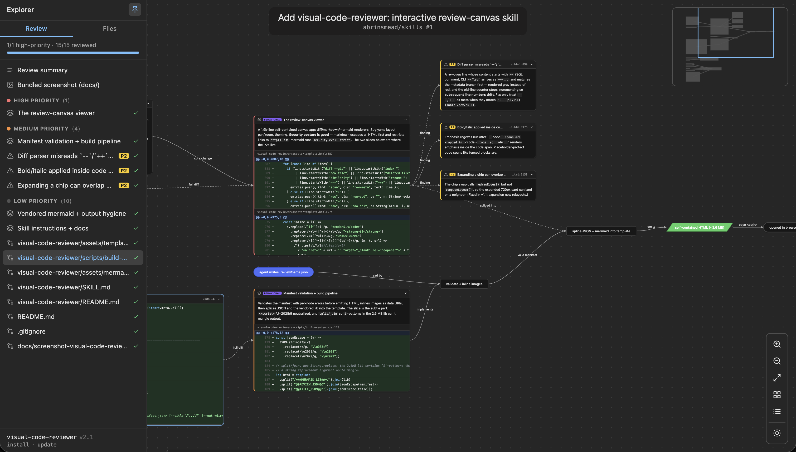

# visual-code-reviewer

An [agent skill](https://agentskills.io) that turns a PR, branch, or diff into an interactive review canvas: draggable cards — per-file diffs, mermaid diagrams, explainer notes, code snippets, screenshots, and P0/P1/P2 warnings — connected by labeled edges on a pan/zoom surface. Each generated file is fully self-contained — nothing to run or host, no network requests, works offline.

Forked from [mermaid-viewer](../mermaid-viewer/): same viewer shell and build pipeline, but the single diagram is replaced by a graph of heterogeneous nodes the agent composes from its analysis of the change.



## Install

Installs via [skills.sh](https://skills.sh), the open agent skills CLI:

```
npx skills add abrinsmead/skills/visual-code-reviewer
```

Update:

```
npx skills update visual-code-reviewer
```

`add` takes the full `owner/repo/skill` source path; `update` takes the installed skill's name.

Works with Claude Code and other agents that support the SKILL.md convention. Requires Node.js ≥ 18.

## Usage

Ask your agent for a visual review:

- "Review this PR visually: https://github.com/acme/api/pull/482"
- "Walk me through this diff on a review canvas"
- "Explain the changes on this branch visually"

The agent gathers the diff (`gh pr diff` / `git diff`), analyzes it, and decomposes it into **semantic changesets** — "extracted retry logic" (behavioral, high risk), "renamed userId across 47 sites" (mechanical, low) — each a card with kind and risk badges, a note on why to trust it, and the diff slices that prove it; warnings ranked P0/P1/P2 pinned to the changeset they concern; flowchart shapes when a runtime flow changed; before/after diagram pairs when a schema or state machine changed; and every file's complete diff one click away as chips or a tray. It writes the graph to `.review/<name>.json`, builds `.review/<name>-<timestamp>.html`, and opens it in your browser. The `.json` manifest is the editable source; each HTML file is standalone and can be shared, archived, or attached anywhere. The canvas title links to the PR.

## Explain mode

The canvas also works without a diff: ask "Explain src/auth visually" or "Give me a code tour of this repo" and the agent builds a `mode: "explain"` manifest — an orientation card, an architecture diagram, line-numbered source excerpts with notes (grouped by subsystem in the explorer), and gotcha/tip/info callouts docked to the code they annotate. The explorer tab becomes **Tour**, progress reads "visited", and `j`/`k` walks the tour in narrative order. File refs link to GitHub blob pages when `url` is a repo link.

## The viewer

- **Pan & zoom** — drag empty canvas to pan, wheel to zoom toward the cursor, fit-to-screen, background dot grid scaled to zoom level
- **A map of the change** — flowchart shapes trace the runtime story (entry points, subprocesses, decisions, outputs) and every changed file docks to the step it touches as a minimized chip; clicking a chip expands the full diff and the canvas relayouts around it. `r` (or the layout button) toggles the layout direction: layered → (default) and layered ↓ (Sugiyama-style — cycle-tolerant layering with slack tightening, median/barycenter crossing reduction, neighbor-pull alignment). Drag any card from anywhere on it to rearrange and edges follow. Text selection is disabled on the canvas — note-like cards (markdown, warnings, callouts) have a hover copy button instead
- **Minimap** — top-right overview showing node placement and the current viewport; click or drag it to jump around a large canvas
- **Node cards** — diffs carry the file's complete change with line numbers and +/− coloring; long unchanged runs fold GitHub-style behind a click-to-reveal row; every card collapses to its header via the chevron; tall bodies scroll internally; the wheel scrolls a scrollable card under the cursor and zooms the canvas everywhere else
- **Warnings** — severity-colored cards (P0 red, P1 orange, P2 yellow) with file:line references
- **Excerpt cards** — the agent slices out the hunks that matter and pairs each with a short note on why it matters; findings link to the exact lines they concern
- **Changed-files tray** — one card lists every changed file as an accordion row (status badge, path, ±stats) that expands into that file's complete diff inline, so full diffs stay one click away without swamping the canvas; file paths link to the file in the GitHub PR's Files tab (new tab), and the title pill shows an `owner/repo #N` subtitle
- **Themes** — follows the OS light/dark preference; manual toggle re-renders mermaid nodes in place
- **Explorer + attention meter** — a left panel with two tabs: **Review**/**Tour** (the review in reading order with risk badges and read checkmarks — click a checkmark to un-mark it) and **Files** (every changed file with status and ±stats); click any entry to fly to its card. Pin button top-right; when unpinned, hovering the left edge peeks it open. `j`/`k` walks review targets by descending risk, marking them read; the meter shows "2/3 high-priority · 5/9 reviewed" and progress persists per manifest in localStorage
- **Readable diffs** — word-level intra-line change emphasis on paired removed/added lines, plus minimal language-agnostic syntax highlighting (strings, comments, numbers, keywords) — all self-contained
- Keyboard: `j`/`k` walk by risk · `f` fit · `r` layout direction · `n` explorer · `m` minimap · `d` theme · `+`/`−`/`0` zoom

No PNG/SVG export in v1 — heterogeneous HTML cards don't rasterize reliably; use the OS screenshot tool.

## Claude artifacts

In Claude Code, ask for the review "as an artifact": the skill builds with the `--artifact` flag and Claude publishes the result as a hosted artifact with a shareable URL. The artifact variant is body-only HTML with no external requests, as required by the artifact sandbox's CSP. Screenshots referenced by image nodes are inlined as data URIs at build time, so they work there too.

## How it works

```
your-agent ──analyzes diff, writes──> .review/name.json
                                        │
scripts/build-review.mjs                │  validates the manifest, inlines images,
                                        ▼  splices JSON + bundled mermaid.min.js
                                           into assets/template.html
                          .review/name-<timestamp>.html   (self-contained, ~3.6 MB)
```

No dependencies beyond Node.js. The `--artifact` flag emits a body-only variant for strict-CSP hosts.

## License

MIT © Alex Brinsmead

Bundles [Mermaid](https://github.com/mermaid-js/mermaid) (MIT) and icons from [Lucide](https://lucide.dev) (ISC).
